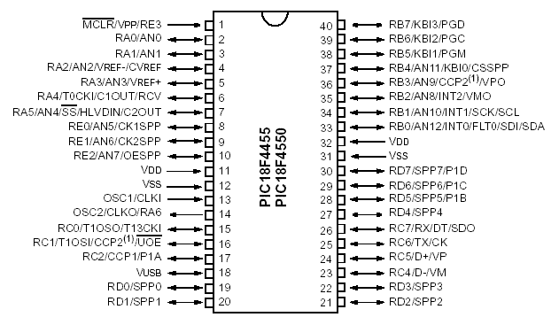
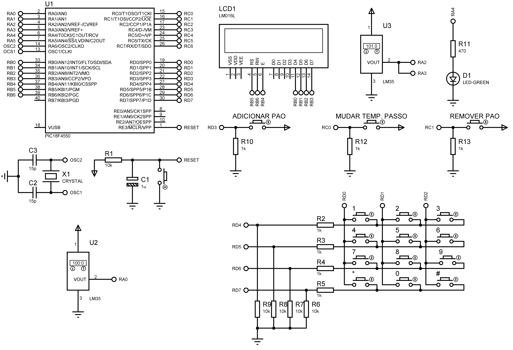
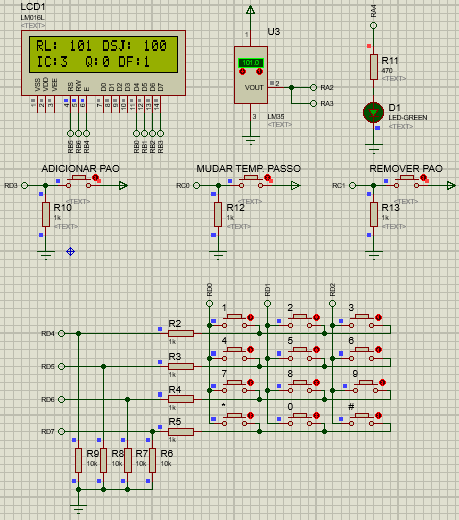

# Industrial Bakery

Firmware that simulates an industrial oven temperature control system in the process of an automatic bakery

## Basic operation

- At the beginning, with the aid of the LCD and the keyboard, the user can enter the step temperature, which consists of the temperature value to be increased by the desired temperature for each bread inserted;
- This value can be anything between 1 to 15ºC, the firmware warns if the temperature is invalid through the LCD.
- After defining the step temperature, the LCD displays this information and updates each change:
  - Actual temperature (of the LM35 connected to the ADC);
  - Desired temperature (set as standard at 50ºC and increased depending on the step temperature)
  - Step temperature (determined by the user at the beginning of the process);
  - Quantity of breads in the oven.
- Regarding the step temperature, desired temperature and number of breads, the following process takes place:
  - Desired temperature starts at 50ºC;
  - With each bread inserted in the oven, the desired temperature is increased to the value of the step temperature. To exemplify with a step temperature of 15ºC, we have:
    | breads | calculation | result |
    |---------------|---------------|---------|
    | Without bread | 0ºC + 0 _ 15 | 50ºC |
    | 1 breads | 50ºC + 1 _ 15 | 65ºC |
    | 2 breads | 50ºC + 2 \* 15 | 80ºC |
- The quantity of bread will be given by a sensor installed at the entrance of the oven that counts the quantity of bread entering the oven;
- The amount of bread in the oven is limited to 5 breads;
- When entering the sixth bread, wait 5 seconds and all the loaves are released (considered as ready), and the count resumes at 1, because of this "sixth bread" that has just entered;
- In addition, the system has a critical temperature control, which when reaching temperatures above 100ºC (real temperature), regardless of the case, activates a cooler for refrigeration. If the temperature drops below 100ºC, the cooler is turned off.

## Advanced operation

- In addition to the step temperature being entered at the beginning, when pressing a key it is possible to change the value;
- The LCD displays and updates with each modification:
  - The actual temperature difference from the desired one.
- A key is used to decrease the amount of bread;
- When the critical temperature reaches the maximum value, an LED flashes 6 times.

## ☁️ Links

- [Basic Specifications](docs/pdf/basic_specifications.pdf)
- [Advanced Specifications](docs/pdf/advanced_specifications.pdf)

## 💻 Project

#### PICF184550



#### Hardware



#### Running Simulation



## 🚀 Technologies

 C ANSI

 Proteus

## 🏃 Usage

Before you compile the code you **have to install the [XC8 Compiler](http://www.microchip.com/mplabxc8windows)**, then just copy and paste one by one the commands bellow:

```
git clone https://github.com/douglasJovenil/industrial-bakery
cd industrial-bakery/src
xc8 -I../include  -I../lib/XLCD -I../lib/ADC -I../lib/LCD ../lib/XLCD/busyxlcd.c ../lib/XLCD/openxlcd.c ../lib/XLCD/putrxlcd.c ../lib/XLCD/putsxlcd.c ../lib/XLCD/readaddr.c ../lib/XLCD/readdata.c ../lib/XLCD/setcgram.c ../lib/XLCD/setddram.c ../lib/XLCD/wcmdxlcd.c ../lib/XLCD/writdata.c ../lib/ADC/ADC.c -I../lib/LCD/LCD.c main.c -Ofirmware --chip=18f4550 --outdir=../build
```

On software Proteus, open the [simulation file](hardware/hardware.pdsprj), right click on PICF18F4550 and click on **edit properties**


Click on folder icon


Navigate to the [build](build) folder and select the hex


Click on **OK** and then click on **play** to start the simulation


